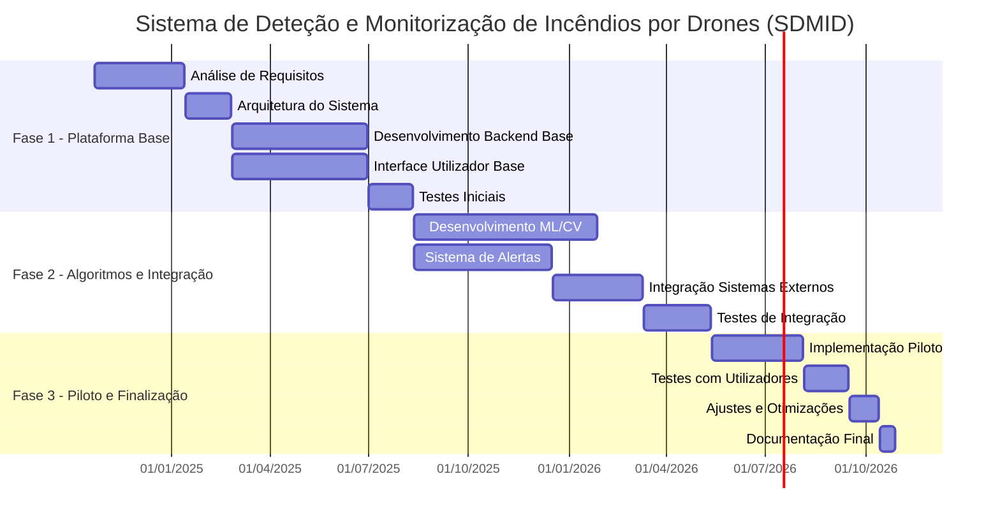

```mermaid
    gantt

title Sistema de Deteção e Monitorização de Incêndios por Drones (SDMID)

dateFormat YYYY-MM-DD

axisFormat %d/%m/%Y


section Fase 1 - Plataforma Base

Análise de Requisitos :2024-10-22, 2025-01-13

Arquitetura do Sistema :2025-01-14, 2025-02-24

Desenvolvimento Backend Base :2025-02-25, 2025-06-30

Interface Utilizador Base :2025-02-25, 2025-06-30

Testes Iniciais :2025-07-01, 2025-08-11


section Fase 2 - Algoritmos e Integração

Desenvolvimento ML/CV :2025-08-12, 2026-01-27

Sistema de Alertas :2025-08-12, 2025-12-16

Integração Sistemas Externos :2025-12-17, 2026-03-10

Testes de Integração :2026-03-11, 2026-05-12


section Fase 3 - Piloto e Finalização

Implementação Piloto :2026-05-13, 2026-08-04

Testes com Utilizadores :2026-08-05, 2026-09-15

Ajustes e Otimizações :2026-09-16, 2026-10-13

Documentação Final :2026-10-14, 2026-10-28
```
