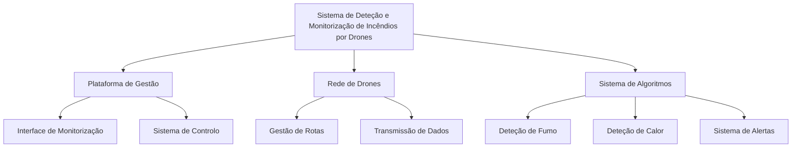

```mermaid
graph TD
    A[Sistema de Deteção e Monitorização de Incêndios por Drones]
    A --> B[Plataforma de Gestão]
    A --> C[Rede de Drones]
    A --> D[Sistema de Algoritmos]

    B --> B1[Interface de Monitorização]
    B --> B2[Sistema de Controlo]

    C --> C1[Gestão de Rotas]
    C --> C2[Transmissão de Dados]

    D --> D1[Deteção de Fumo]
    D --> D2[Deteção de Calor]
    D --> D3[Sistema de Alertas]
```