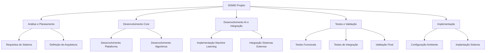

```mermaid
graph TD
    A[SDMID Projeto]
    A --> B[Análise e Planeamento]
    B --> B1[Requisitos do Sistema]
    B --> B2[Definição de Arquitetura]

    A --> C[Desenvolvimento Core]
    C --> C1[Desenvolvimento Plataforma]
    C --> C2[Desenvolvimento Algoritmos]

    A --> D[Desenvolvimento AI e Integração]
    D --> D1[Implementação Machine Learning]
    D --> D2[Integração Sistemas Externos]

    A --> E[Testes e Validação]
    E --> E1[Testes Funcionais]
    E --> E2[Testes de Integração]
    E --> E3[Validação Final]

    A --> F[Implementação]
    F --> F1[Configuração Ambiente]
    F --> F2[Implantação Sistema]
```